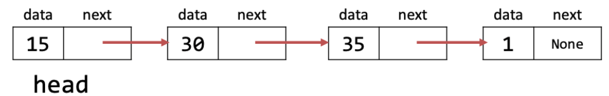
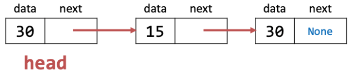
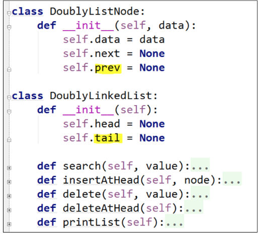

# Data Type vs Abstract Data Type (ADT)
- Data Type
    - a set of values
    - a set of operations of those values
- ADT is a data type whose representation / implementation is hidden from the users
# Abstract Data Type
- Supports encapsulation in program design
- specifies precisely the problem
- Describes the algorithms and data structures (as API) to be used by clients

> [!note] ➡️
> When using ADT
# Array
- a linear data structure consisting of a fixed number of data items of the same type
## Array operations
- Access array element directly through index
## Multi-Dimensional Array
- Array of arrays
- More than one index can be used to access elements in a particular position
# Stack
- Stack is a linear data structure which holds elements of a single data type
- Last-in-First-Out (LIFO or FILO)
## Operations
- push(value)
    - add value to the top of the stack
- pop()
    - remove and return the value on top of the stack
## Stack ADT
- Data
    - top
        - keep track of the top index
    - data
        - some linear operation structure to store data
- Operations
    - push(value)
        - extends the size of the stack by 1
        - increase the top index by one
        - Assign value to the element at the top
    - pop()
        - read the value of the element at the top
        - delete the element at the top
        - decrease the top index by 1
        - return the value
    - isEmpty()
        - return true if the stack is empty; false otherwise
    - peek()
        - return the value at the top without removing the value from the stack
# Queue
- linear data structure which holds multiple elements of a single data type
- First-In-First-Out
    - Adding at the rear
    - removing at the front
## Queue operations
- enqueue(value)
    - add value to the rear of the queue
- dequeue()
    - remove and return the value of the item from the front of the queue
## Queue ADT
- Data
    - rear
        - keep track of the rear index
    - data
        - some linear structure to store all the elements in the queue
    - assumption
        - front is always at index 0
- operations
    - enqueue(value)
        - extends the size of the queue by 1
        - increase the rear index by one
        - assign the value to the element at the rear index
    - dequeue
        - read the value at index 0 (front)
        - delete the element at index 0
        - decrease the rear index by one
        - return value
        - exception
            - if the queue is empty
                - print error message
# Single Linked-list
- A single linked list is a linear data structure in which each element (node) consists of two items
    1. Data
    2. Reference (link/pointer)  to the next node in the list
## SinglyList Node ADT

- each node consist of two items
    1. Data
    2. Link to the next node

> [!note] ➡️
> intialize a new node with data and None link to the next node. The link can be set later
> None is similar to null pointer

### Visualization

- How to access element in this list?
    - start from head node
    - use next poitner to access the next node in the list

### operations
- InsertAtHead(node)
    - insert a new node at the beginning of the list
- search(value)
    - search and return the node whose data is equal to value
- delete(value)
    - Delete the node whose data is equal to value
## Singly Linked List ADT
- Data
    - head
        - the head node of the list
- operations
    - insertAtHead(node)
        - if the list is empty(head id None) then assign node to head
        - else [node.next](http://node.next/) = head
head = node

    - search(value)
        - start from the head node
        - compare the data at the node with the value
        - if data is not same as value
            - go next node
        - else
            - return node
        - repeat until end of list
    - delete(value)
        - start at the head node
        - search for the node whose data = value and keep track of the previous node of temp
        - [prev.next](http://prev.next/) = temp.next
        - delete temp

## Doubly Linked list ADT

- consist of three items:
    - Data
    - reference to next node in the list
    - link to the previous node in the lsit
