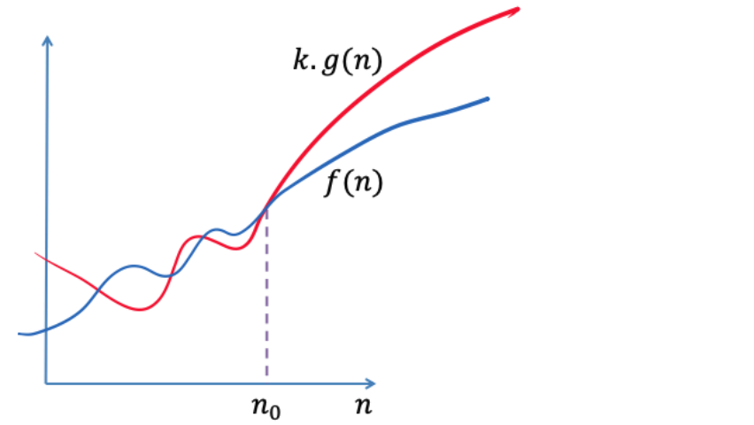
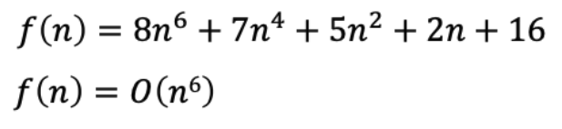
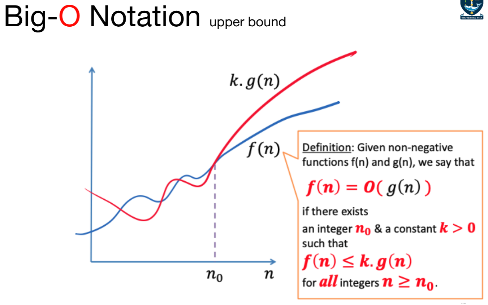
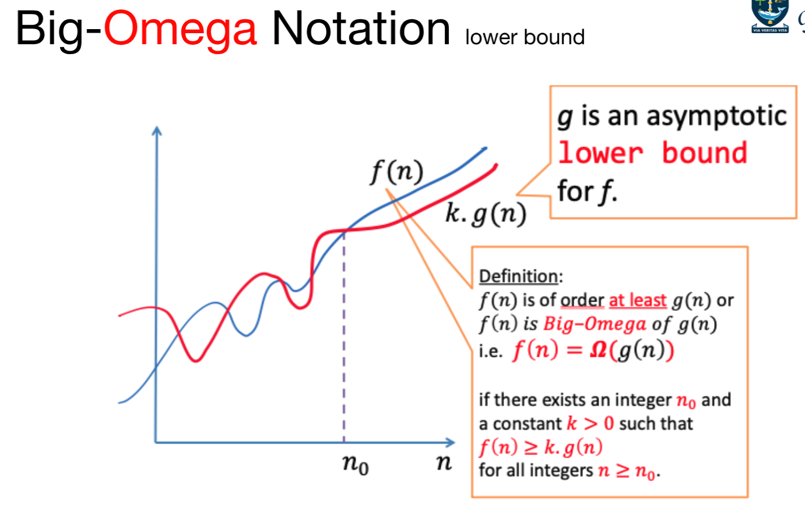
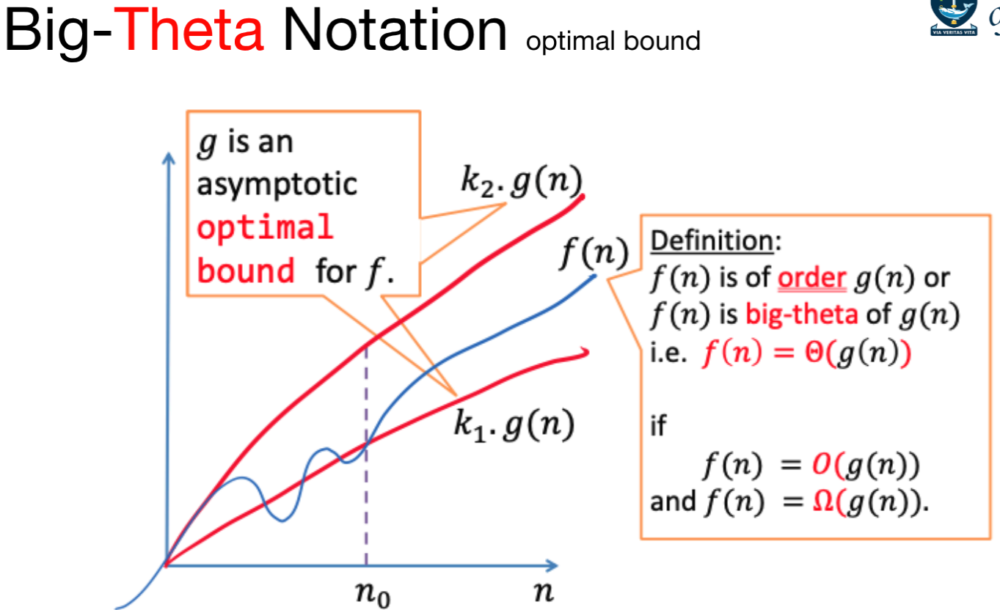

# Analysis of Algorithms

- To analyse an algorithm is to determine the amount of resources (such as time and storage) necessary to execute it
$$(Time/Space)\times Complexity = f(n)$$
**running time of an algorithm typically grows with the input size `n`
- Two ways to analyse an algorithm
    - Empirical / Experimental studies
    - Theoretical analysis
## Empirical Study Method
1. Write a program to implement the algorithm
2. Run the program with inputs of varying sizes and compositions
3. Get an accurate measure of the actual running time
4. Plot the results
### Issues
- System dependent effects:
    - Hardware
        - CPU, Memory, Cache
    - Software
        - Compiler, Interpreter, Garbage collector
    - System
        - OS, network, other applications
## Theoretical Analysis
- To analyse the running time of algorithms, use a simple model of the underlying computer
- Aim
    - make simplifications to estimate resources to execute an algorithm
- Exact time
    - machine instructions for different machines are not relevant here
- We use a model of Random Access Machine (RAM)
- Primary challenge
    - determine the frequency of execution statements.
### RAM Model
- consider sequential 1-Processor architecture, no parallelism
- All data are directly accessible in memory
- All memory accesses take the same length
- All elementary operations require constant time
- Elementary operations are:
    - value assignment
    - Arithmetic operations such as addition, subtraction, multiplication
    - Logical operations such as `AND` and `OR`
    - Comparison operations such as `>` or `<` 
    - Commands to control the flow of instructions such as `IF THEN ELSE` 
- For simplicity, assume each elementary operation takes on time unit
### Example: 1-SUM
```python
def count(a,N):
	sum = 0
	for i in range(N):
		if a[i] == 0:
			sum += 1
	return sum
```

- How many instructions as a function of input size `N` 

| Operation                          | Frequency        |
| ---------------------------------- | ---------------- |
| Assignment Statement               | 1                |
| For Loop<br>`in range`  comparison | N+1              |
| `if equal`  comparison             | N                |
| if equal                           | N                |
| Array access                       | N                |
| Increment                          | N                |
| Total                              | (3N+2) to (4N+2) |

### Example: 2-SUM

```python
def count(a,N):
	sum = 0
	for i in range(N): #[A] N+1 comparison
		for j in range(i+1, N): #[B] i=0, j=1 ... N => N comparisons
								#    i=1, j=2 ... N => N-1 comparisons
								#    i=N-2, j=N-1 ... N => 2 comparisons
								#    i=N-1, j=N ... N => 1 comparison
			if a[i] + a[j] == 0:
				sum += 1
	return sum
```

| Operation                          | Frequency                                                                                              |
| ---------------------------------- | ------------------------------------------------------------------------------------------------------ |
| Assignment Statement               | 1                                                                                                      |
| For Loop<br>`in range`  comparison | (N+1) + [N+(N-1) + … + 1 + 0] = $\frac{1}{2}$N(N+3)+ 1<br>[A]      + [               B               ] |
| equal Comparison                   | N+1 + [N+(N-1) + … + 1 + 0] = $\frac{1}{2}$N(N-1)                                                      |
| Array access []                    | N(N-1)                                                                                                 |
| Increment                          | 0 to $\frac{1}{2}$N(N-1)                                                                               |
| Total                              | $2N^2 + 2$ to $\frac{1}{2}N(5N-1)+2$                                                                   |

> [!note] ➡️
> [A] Outer loop comparison
> [A] = N + 1
> 
> [B] Inner Loop comparison
> 
> [B] = $\frac{N(N+1)}{2}$, using arithmetic series sum of first N integers 
> 
> $\frac{N}{2}[2(1) + (N-1)*1] = \frac{N}{2}(N+1)$
> 
> $(N+1) + \frac{N}{2}(N+1) = \frac{2N+2}{2} + \frac{N(N+1)}{2} = \frac{N^2+N +2N+2}{2} = \frac{N^2+3N+2}{2}$
> 
> $= \frac{N^2+3N}{2} + \frac{2}{2} = \frac{N(N+3)}{2} + 1$

## Asymptotic Notation: Comparing Algorithm

- Consider two algorithms, A and B, for solving a given problem
- Let the running times of the algorithms be $T_a(n)$ and $T_b(n)$ for problem size `n` 
- Suppose the problem size is $n_0$ and 
$T_a(n_0) < T_b(n_0)$
Then the algorithm A is better than algorithm b for a problems size $n_0$
- If $T_a(n) < T_b(n)$ for all n ≥ $n_0$
    - then algorithm A is better than algorithm B regardless of the problem size 
- For algorithm analysis
    - emphasise on the operation count
    - <u>Order of growth</u> for <u>large input</u> sizes
- Consider the asymptotic behaviour of two algorithms for large problem sizes, under worst-case
### Big-O Notation
- concerned with what happens for very of large value of `n` 



> [!note] ➡️
> 
> - Given non-negative functions f(n) and g(n), we say that f(n) = O(g(n)) if there exists an integer $n_0$ & constant k > 0 such that f(n) ≤ k.g(n) for all integers n ≥ $n_0$
> - f(n) = O(g(n)) means f(n) is of order <u>at most</u> g(n) or f(n) is big-o of g(n) 
> 
> f(n) is bounded above by g(n)
> 
> the worst-case runtime of f(n) is g(n)

### Big-O Example: 1-SUM

```python
def count(a,N):
	sum = 0
	for i in range(N):
		if a[i] == 0:
			sum += 1
	return sum
```

> [!note] ➡️
> Proof:
> need to prove this condition
> 
> 4n + 2 ≤ kn for all n ≥ $n_0$
> 
> can we find k (>0) and $n_0$?
> 
> We can say that the worst case runtime of 1-SUM is O(n)

### Big-O Example: 2-SUM

```python
def count(a,N):
	sum = 0
	for i in range(N): #[A] N+1 comparison
		for j in range(i+1, N): #[B] i=0, j=1 ... N => N comparisons
								#    i=1, j=2 ... N => N-1 comparisons
								#    i=N-2, j=N-1 ... N => 2 comparisons
								#    i=N-1, j=N ... N => 1 comparison
			if a[i] + a[j] == 0:
				sum += 1
	return sum
```

> [!note] ➡️
> Max:  $\frac{1}{2}n(5n-1)+2$
> prove $\frac{1}{2}n(5n-1)+2$ is O(n^2):
> 
> $\frac{1}{2}n(5n-1)+2$ ≤ $kn^2$ for all n ≥ $n_0$
> 
> $5n^2 -n + 4 ≤ 2kn^2$
> 
> we have:

## Big-O Rules

- if f(n) is a polynomical of degree d, then f(n) = O(n^d)
    - drop lower-order terms
    - drop constant factors
- Example


## Big-O and Growth Rate

The big-O notation gives an upper bound on the growth rate of a function

- the statement `f(n) is O(g(n))` means that the growth rate of f(n) is no more than the growth rate of g(n)

## Complexity Classes order by low to high
- O(1) denotes constant running time
- O(log n) denotes logarithmic running time
- O(n) denotes linear running time
- O(n log n) denotes log linear running time
- O(n^c) denotes polynomial running time (c is a constant)
- O(c^n) denotes exponential running time (c is a constant being raised to a power based on size of input)
## Type of Analyses
- Worst case (Big-O)
    - upper bound on cost
        - performance guarantee for any input
        - my code takes at most this long to run
    - Determined by “most difficult” input
    - provides a guaranteed for all inputs
- Best case (Big-Omega)
    - Lower bound on cost
        - Proof that no algorithm can do better
        - My code takes at least this long to run
    - Determined by “easiest” input
    - provides a goal for all inputs
- Average case (Big-Theta)
    - Expected cost for random input
        - Lower bound = upper bound (to within a constant factor)
        - My code takes “exactly” this long to run
    - Needs a model for “random” input
    - Provides a way to predict performance
### Example
- Suppose a list *L* of some length `len(L)`
    - Best case. minimum running time over all possible input of a given size `len(L)`
        - constant for `search_for_element`
        - First element of the list
    - Average case. Average running time over all possible inputs of a given size `len(L)`
        - practical measure
    - Worst case. Maximum running time over all possible input of a given size `len(L)`
        - linear in length of list for `search_for_element`
        - Must search entire list and not find it
## General Plan for Algorithm Runtime Analysis
- Decide on parameter n indicating input size
- Identify algorithm’s basic operation - cost model
- Set up a sum expressing the number of times the basic operation is executed
- Simplify the sum using standard formulas and rules to determine the big-O of the running time.
# Comparison of Big-O, Omega & Theta Graph

## Big-O



## Big-Omega



## Big-Theta



# Decision Tree to determine Big-O
- is loop dependent? `for i in range(n)`
	- Yes `for j in range(i)`
		- is outer loop linear or exponential (\*2 or //2) 
			- linear `for i in range(n)`
				- is inner loop logarithmic (\*2 or //2) 
					- yes `for j in range(0, i, *2)`
						- O($n\log n$)
					- no `for j in range(i)`
						- n^2
			- exponential `for i in range(1,n, *2)`
				- is inner loop logarithmic?
					- yes `for j in range(0,i,*2)`
						- O(($\log n)^2)$)
					- no 
						- (0 to i) or (i to n)
							- `for j in range(i)`
								- O(n)
							- `for j in range(i, n)`
								- O($n\log n$)
	- No `for j in range(n)`
		- multiply