# Undirected Graph
- set of vertices connected pairwise by edges
# Graph Terminology
- path
	- sequence of vertices connected edges
- Cycle
	- path whose first and last vertices are the same
- Two vertices are connected if there is a path between them
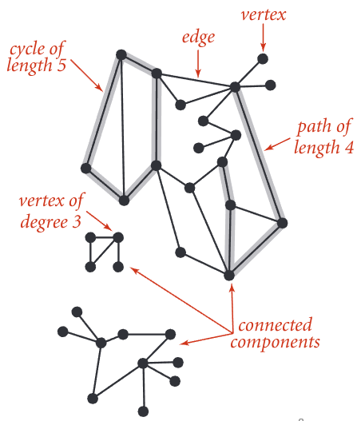
# Graph Representations
- Vertex representation
	- use integers between 0 and V-1
	- Applications
			- convert between names and integers with symbol table 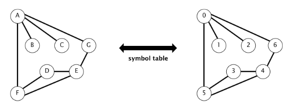
		- Anomalies
		  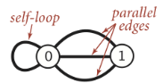
# Graph API

| Public class Graph         | Description                           |
| -------------------------- | ------------------------------------- |
| Graph(int v)               | Create an empty graph with V vertices |
| Graph(File f)              | Create a graph from input file f      |
| Void addEdge(int v, int w) | Add an edge v-w                       |
| Iterable\<int> adj(int v)  | Vertices adjacent to v                |
| Int V()                    | number of vertices                    |
| int E()                    | number of edges                       |
```Python
class Graph:
	adjList = []
	def __init__(self, file):
		f = open(file, "r")
		for line in f:
			v1, v2 = line.split(" ")
			v1 = int(v1)
			v2 = int(v2)
			if v1 in self.adjList:
				self.adjList[v1].append(v2)
			else:
				self.adjList[v1] = []
				self.adjList[v1].append(v2)
			if v2 in self.adjList:
				self.adjlist[v2].append(v1)
			else:
				self.adjList[v2] = []
				self.adjList[v2].append(v1)
				
g = Graph("tinyG.txt")
for v in g.adjList.keys():
	for w in g.adjList[v]:
		print(f"{v} - {w}")
```
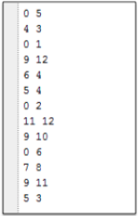 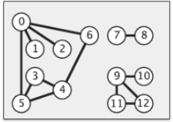 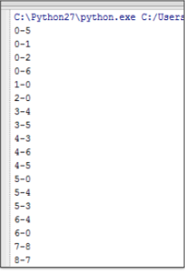
# Graph Representation
## Adjacency Matrix
- Maintain a two dimensional V-by-V Boolean array
- For each edge v-w in graph: `adj[v][w] = adj[w][v] = true` 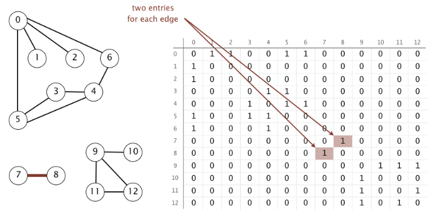
## Adjacency List
- Maintain vertex-indexed array of lists
	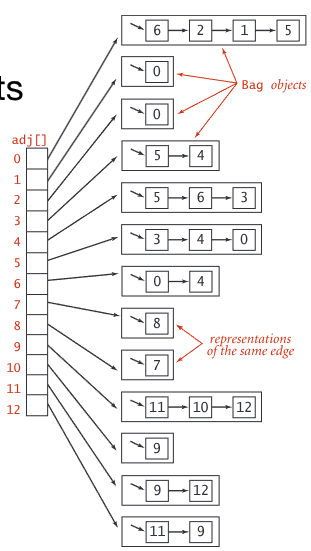 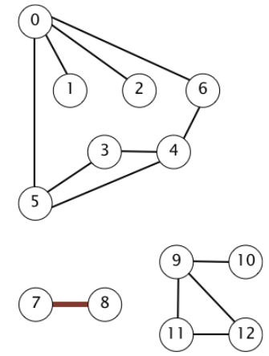
## Summary
- in practice, use adjacency-lists representation
	- Algorithms based on iterating vertices adjacent to v
	- Real-world graphs tend to be sparse (huge number of vertices, small average vertex degree)

| Representation   | Space | add edge | edge between v and w? | iterate over vertices adjacent to v? |
| ---------------- | ----- | -------- | --------------------- | ------------------------------------ |
| List of edges    | E     | 1        | E                     | E                                    |
| Adjacency matrix | $V^2$ | 1        | 1                     | V                                    |
| Adjacency list   | E + V | 1        | degree(v)             | degree(v)                            |
## Adjacent List Implementation
```Python
class Graph:
	adjlist = []
	def __init__(self, file):...
	def addEdge(self, v, w):
		if v in self.adjList:
			self.adjList[v].append(w)
		else:
			self.adjList[v] = []
			self.adjList[v].append(w)
			
		if w in self.adjList:
			self.adjList[w].append(v)
		else:
			self.adjList[w] = []
			self.adjList[w].append[v]
			
	def adj(self, v):
		return self.adjList[v]
```
# Maze Exploration
- Maze Graph
	- Vertex = intersection
	- Edge = passage
	- Goal
	- explore every intersection in the maze 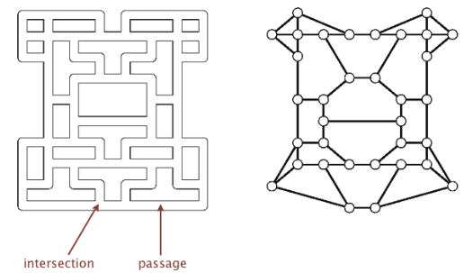
## Depth First Search
- Goal
	- systematically traverse a graph
- Idea
	- mimic maze exploration
		- mark v as visited
		- recursively visit all unmarked vertices w adjacent to v
	- Typical applications:
		- Find all vertices connected to a given source vertex
		- Find a path between two vertices
### Data Structures
- to visit a vertex v:
	- mark vertex v as visited
	- Recursively visit all unmarked vertices adjacent to v
- Boolean array `marked[]` to mark visited vertices
- Integer array `edgeTo[]` to keep track of paths
	- `(edgeTo[w] == v)` means that edge v-w taken to visit w for first time
- Function-call stack for recursion
```Python
class DepthFirstPaths:
	marked = []
	edgeTo = []
	s = None
	
	def __init__(self, G, s):
		for v in G.V():
			self.marked[v] = False
			self.edgeTo[v] = None
		self.s = s
		self.dfs(G,s)
	
	def dfs(self, G, v):
		self.marked[v] = True
		for w in G.adj(v):
			if not self.marked[w]:
				self.dfs(G, w)
				self.edgeTo[w] = v
```
### Properties
- After DFS, can check if vertex v is connected to s in constant time and can find v-s path (if one exists) in time proportional to its length
	- `edgeTo[]` is parent-link representation of a tree-rooted at vertex s
```Python
def hasPathTo(self, v):
	  return self.marked[v]
	  
def pathTo(self, v):
	if not self.hadPathTo(v):
		return None
	path = []
	x = v
	path.append(v)
	while x != self.s:
		x = self.edgeTo[x]
		if x is not None:
			path.append(x)
	return path
```
## Breadth First Search
- repeat until queue is empty
	- remove vertex v from queue
	- Add to queue all unmarked vertices adjacent to v and mark them
### Implementation
```Python
from collections import deque
class BreadthFirstPaths:
	marked = []
	edgeTo = [] # number of links connected to vertex from root
	distTo = [] # shortest distance from root to vertex (weight)
	s = None
	def __init__(self, G, s):
		for v in G.V():
			self.marked[v] = False
			self.edgeTo[v] = None
			self.distTo[v] = None
		self.s = s
		self.bfs(G,s)
		
	def bfs(self, G, v):
		q = deque()
		q.append(v)
		self.marked[v] = True
		self.distTo[v] = 0
		
		while len(q) <> 0:
			w = q.popleft()
			for x in G.adj(w):
				if not self.marked[s]:
					q.append(x)
					self.marked[x] = True
					self.edgeTo[x] = w
					self.distTo[x] = self.distTo[w] + 1
```
### Properties
- in which order does BFS examine vertices?
	- increasing distance (number of edges) from s
- in any connected G, BFS computes the shortest paths from s to all other vertices in time proportional to E+V 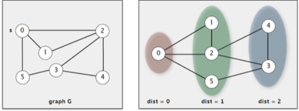
## Directed Graph
- Digraph
	- set of vertices connected pairwise by directed edges 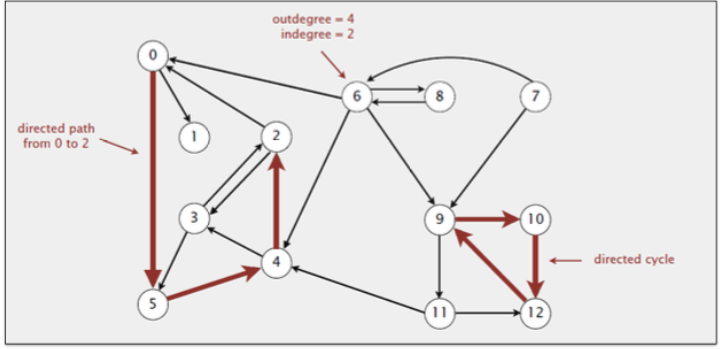
- Examples
	- Road Network
		- vertex = intersection
		- edge = one way street
	- Grab Taxi Graph
		- Vertex = taxi pick up
		- Edge = taxi ride
	- Combinational Circuits
		- Vertex = logical gate
		- edge = wire
## Representation
- in practice: use adjacency-list representation
	- algorithms based on iterating over vertices pointing form v
	- real-world digraphs tends to be sparse

| representation   | space | Insert edge from v to w | edge from v to w | iterate over vertices point from v |
| ---------------- | ----- | ----------------------- | ---------------- | ---------------------------------- |
| list of edges    | E     | 1                       | E                | E                                  |
| Adjacency matrix | $V^2$ | 1                       | 1                | V                                  |
| Adjacency list   | E + V | 1                       | outdegree(v)     | outdegree(v)                       |
### Implementation
```Python
class DiGraph:
	adjList = []
	
	def __init__(self, file):
		f = open(file, "r")
		for line in f:
			v1, v2 = line.split(" ")
			v1 = int(v1)
			v2 = int(v2)
			
			if v1 in self.adjList:
				self.adjList[v1].append(v2)
			else:
				self.adjList[v1] = []
				self.adjList[v1].append(v2)
			if v2 not in self.adjList:
				self.adjlist[v2] = []
				
	def addEdge(self, v, w):
		if v in self.adjList:
			self.adjList[v].append(w)
		else:
			self.adjList[v] = []
			self.adjList[v].append(w)
		
		if w not in self.adjList:
			self.adjList[w] = []
```
## Precedence Scheduling
- Goal
	- given a set of tasks to be completed with precedence constraints, in which order we should schedule tasks?
- Digraph model
	- vertex = task
	- edge = precedence constraints

0. Algorithms
1. Complexity Theory
2. Artificial Intelligence
3. Intro to CS
4. Cryptography
5. Scientific Computing
6. Advanced Programming
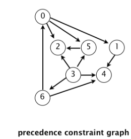 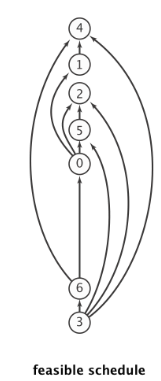
## InOrder, PreOrder, PostOrder
- A graph traversal is a specific order in which to trace the nodes of a tree
- There are 3 common tree traversals
	- in order -> left root right
	- pre order -> root left right
	- Post order -> left right root
## Topological sort
- run depth first search
- return vertices in reverse post order
- DAG -> directed acyclic graph
- redraw DAG so all edges point upwards
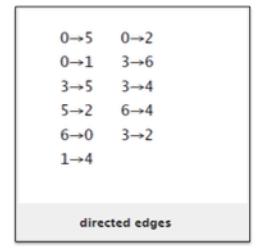
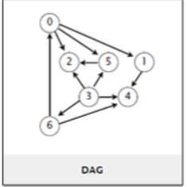
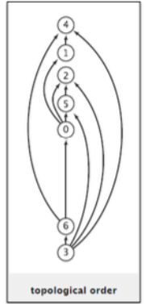
### Implementation
```Python
from DiGraph import DiGraph

class TopoSort:
	marked = []
	revPostOrder = []
	
	def __init__(self, G):
		for v in G.V():
			self.marked[v] = False
		for v inn G.V():
			if self.marked[v] is False
				self.dfs(G,v)
				
	def dfs(self, G, v):
		self.marked[v] = True
		for w in G.adj(v):
			if not self.marked[w]:
				self.dfs(G,w)
		self.revPostOrder.append(v)

G = DiGraph("tinyDG.txt")
ts = TopoSort(G)
print ts.revPostOrder
```
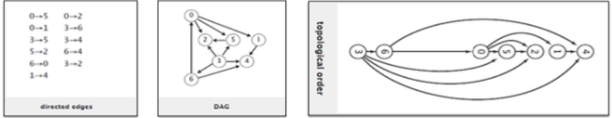
# Spanning Tree
- problem
	- design a transportation system that
		- connect a set of cities so that passengers can go from any cities to any other cities through connecting cities
		- use roads, rails, air to connect cities
- There a several choices of links between a pair of cities
	- Which link would you use
	- cannot use a complete graph
	- passengers can change at each cities for further connections
	- Minimize the number of links, or the total length of the links used
- Definition
	- a spanning tree of graph G is a subgraph T that is 
		- connected
		- acyclic
			- a subgraph that does not form a loop
			- A -> B -> C and not A -> B -> C -> A
		- includes all of the vertices
- Input
	- undirected graph G with positive edge weights (connected)
- Output
	- find a minimum weight spanning tree

| Application        | Vertex      | Edge              |
| ------------------ | ----------- | ----------------- |
| Circuit            | Component   | Wire              |
| Airline            | airport     | flight route      |
| Power distribution | Power plant | Transmission line |
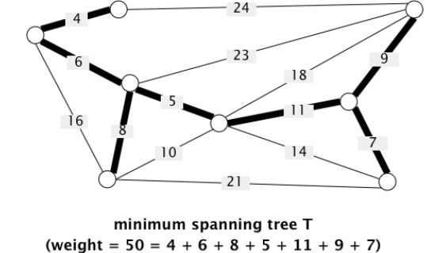
## Assumptions
1. What if edge weights are not all distinct?
	1. Greedy MST algorithm still correct if equal weight are present
2. What if graph is not connected
	1. Computer Minimum Spanning Forest = MST of each component
## Weighted Edge API
- Edge abstraction needed for weighted edges
	```java
	public class edge implements Comparable<Edge>
	```

| Edge(int v, int w, double weight) | create a weight edge v-w        |
| --------------------------------- | ------------------------------- |
| int either()                      | either endpoint                 |
| int other(int v)                  | the endpoint that's not v       |
| int compareTo(Edge that)          | compares this edge to that edge |
| double weight()                   | the weight                      |
| String toString()                 | string representation           |
- Methods for processing edge: `e: int v = e.either(), w = e.other(v)`
## Implementation
```Python
class Edge:
	v = None
	w = None
	weight = None
	
	def __init__(self, v, w, wt):
		self.v = v
		self.w = w
		self.weight = wt
		
	def either(self):
		return self.v
	
	def other(self, v):
		if v == self.v:
			return self.w
		return self.v
		
	def __ge__(self, other):
		return self.weight >= other.weight
	
	def __le__(self, other)
		return self.weight <= other.weight
		
	def __eq__(self, other):
		return self.weight == other.weight
	
	def toString(self):
		return f"[{self.v}-{self.w}, {self.weight}]"
```
## Adjacency List Representation
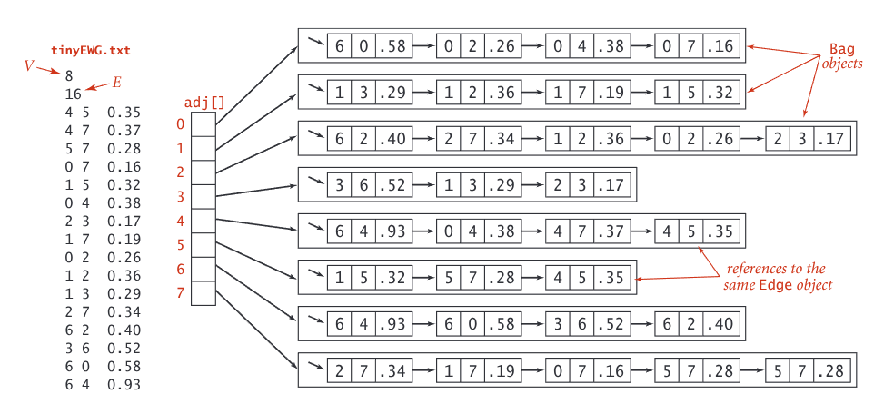
## Implementation
```Python
class EdgeWeightedGraph:
    adjList = {}

    def __init__(self, file):
        f = open(file, "r", encoding="utf-8")
        for line in f:
            v1, v2, v3 = line.split()
            v1 = int(v1)
            v2 = int(v2)
            v3 = float(v3)

            self.addEdge(v1, v2, v3)

    def addEdge(self, v, w, wt):
        e = Edge(v, w, wt)
        if v in self.adjList:
            self.adjList[v].append(e)
        else:
            self.adjList[v] = []
            self.adjList[v].append(e)

        if w in self.adjList:
            self.adjList[w].append(e)
        else:
            self.adjList[w] = []
            self.adjList[w].append(e)

    def adj(self, v):
        return self.adjList[v]

    def V(self):
        return self.adjList.keys()
```
# Prim's Algorithm
- Start with vertex 0 and greedily grow tree T
- add T the min weight edge with exactly one endpoint in T
- repeat until `V-1` edges
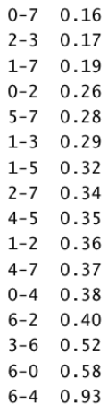
edge-weight graph ^
MST edges:
0-7 1-7 0-2 2-3 5-7 4-5 6-2 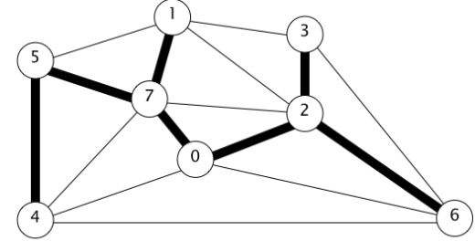
## Steps
1. add node 0 to MST and insert neighbour of 0 into Priority Queue
2. add node 7 to MST and delete min edge 0-7 from PQ
3. insert neighbour of 7 into PQ
4. add node 1 into MSt and delete min edge 1-7 from PQ
5. add neighbours of node 1 into PQ
6. add node 2 into MST and delete min edge 0-2 from PQ
7. add neighbours of node 2 into PQ
8. add node 3 into MST and delete min edge 2-3 from PQ
9. add neighbours of node 3 into PQ
10. add node 5 into MST and delete min edge 5-7 from PQ
11. repeat until PQ is empty
## Implementation
- challenge
	- find the min weight edge with exactly one endpoint in T
- Solution
	- Maintain a PQ of edges with (at least) one endpoint in T
	- Key = edge; priority = weight of edge
	- delete-min to determine next edge e = v-w to add to T
	- disregard if both vertices v and w are marked (both in T)
	- Otherwise, let w be the unmarked vertex (not in T)
		- add to PQ, any edge adjacent to W (assuming the other vertex is not in T)
		- add e to T and mark w
### Lazy Implementation
- 1-7 is min weight edge with exactly one endpoint in T
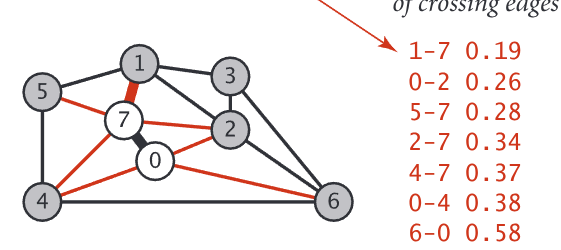
```Python
from collections import deque
from spanning import EdgeWeightedGraph
import heapq

class PrimMST:
    marked = {}
    mst = deque()
    pq = None
    count = 0

    def __init__(self, G: EdgeWeightedGraph) -> None:
        self.pq: PriorityQ = PriorityQ()

        for v in G.V():
            self.marked[v] = False
        
        v = G.V()[0]
        self.count = 0
        self.visit(G, v)
        while not self.pq.isEmpty() and len(self.mst) < G.V().__len__() - 1:
            edge = self.pq.delMin()
            v = edge.either()
            w = edge.other(v)

            if self.marked[v] and self.marked[w]:
                continue

            self.mst.append(edge)

            if not self.marked[v]:
                self.visit(G, v)
            if not self.marked[w]:
                self.visit(G, w)

    def visit(self, G: EdgeWeightedGraph, v: int):
        self.marked[v] = True
        for e in G.adj(v):
            if not self.marked[e.other(v)]:
                self.pq.insert(e.weight, e)
                self.count += 1

    def edges(self):
        return self.mst

class PriorityQ():
    def __init__(self) -> None:
        self.pq = []

    def insert(self, priority, item):
        heapq.heappush(self.pq, (priority, item))

    def delMin(self):
        return heapq.heappop(self.pq)[1]

    def isEmpty(self):
        return len(self.pq) == 0
    
if __name__ == "__main__":
    g = EdgeWeightedGraph("tinyEWG.txt")
    sum = 0
    mst = PrimMST(g)
    for edge in mst.edges():
        sum += edge.weight
        print(f"{edge.v} - {edge.w} : {edge.weight}")
    print(sum)
```
## Running Time
- Prim's algorithm computes the MST in time proportional to E log E and extra space proportional to E (in the worst case)

| Operation  | $f$ | Binary Heap |
| ---------- | --- | ----------- |
| delete min | E   | log E       |
| insert     | E   | log E       |
# Kruskal's Algorithm
- consider edges in ascending order of weight
	- add next edge to tree T unless doing so would create a cycle
## Implementation
- Challenge
	- how to determine if adding edge-v-w to tree T, would create a cycle?
- Efficient solution: use the union-find data structure 
	- Maintain a set for each connected component in T
	- if v and w are in the same set, then adding v-w would create a cycle
	- to add v-w to T, merge sets containing v and w
```Python
from collections import deque
from spanning import EdgeWeightedGraph
from PriorityQ import PriorityQ
from UnionFind import UnionFind


class KruskalMST:
    mst = deque()

    def __init__(self, Q: EdgeWeightedGraph) -> None:
        # build priority queue of edges in non-decreasing order of weight
        pq: PriorityQ = PriorityQ()
        for e in Q.E():
            pq.insert(e.weight, e)

        uf = UnionFind(Q.V().__len__())
        while not pq.isEmpty() and len(self.mst) < Q.V().__len__() - 1:
            e = pq.delMin()  # get edge with minimum weight
            print("min edge: ", e.toString())
            v = e.either()
            w = e.other(v)

            if not uf.connected(v, w):  # edge v-w does not create a cycle
                uf.union(v, w)  # merge sets
                self.mst.append(e)  # add edge to mst

    def edges(self):
        return self.mst


if __name__ == "__main__":
    g = EdgeWeightedGraph("tinyEWG.txt")
    sum = 0
    mst = KruskalMST(g)
    for e in mst.edges():
        sum += e.weight
        print(f"{e.v} - {e.w} : {e.weight}")
    print(sum)
```
# Shortest Path
- given an edge-weight DiGraph, Find the shortest path from s to t 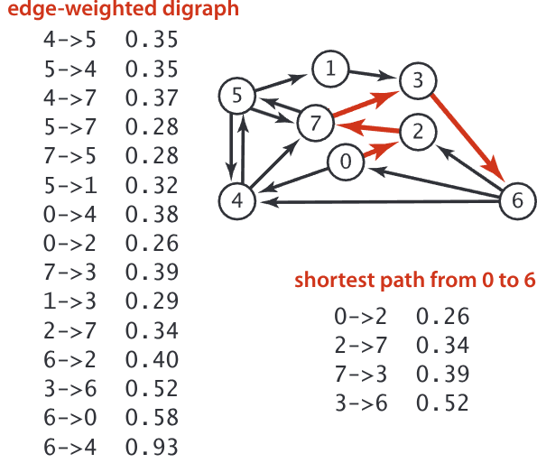
### Weight Directed Edge API

| public class DirectedEdge                 | Description          |
| ----------------------------------------- | -------------------- |
| DirectedEdge(int v, int w, double weight) | Weighted edge v-> w  |
| int src()                                 | source vertex v      |
| int dest()                                | destination vertex w |
| double weight                             | weight of this edge  |
- idiom for processing an edge `e`: `int v = e.src()`, `w=e.dest()`
## Implementation
```Python
class SP:
    """
    compute SPT from s
    initialize distTo[v] to infinity, except distTo[s] = 0 for all vertices

    repeat until optimality conditions are satisfied:
        relax an edge
    """

    def __init__(self, G: EdgeWeightedDigraph, s) -> None:
        self.distTo = {v: float("inf") for v in G.V()}
        self.edgeTo = {v: None for v in G.V()}
        self.distTo[s] = 0
        self.pq = PriorityQ()
        self.pq.insert(0, s)
        while self.pq.isEmpty() is False:
            priority, v = self.pq.delMin()
            print(f"POP: {v} with {priority}")
            if priority > self.distTo[v]:
                continue
            for e in G.adj(v):
                self.relax(e)

    def relax(self, e):
        src = e.src()
        dst = e.dst()
        if self.distTo[dst] > self.distTo[src] + e.weight:
            self.distTo[dst] = self.distTo[src] + e.weight
            self.edgeTo[dst] = e
            self.pq.insert(self.distTo[dst], dst)
```

## Data structure for Single-Source Shortest Paths
- Goal
	- find the shortest path from s to every other vertex
- represent the shortest-path tree (SPT) from s to v
	- `distTo[v]` is length of shortest path from s to v
	- `edgeTo[v]` is the last edge on the shortest path from s to v
### Edge Relaxation
- relax edge e = v -> w
	- `distTo[v]` is length of shortest path from s to v
	- `distTo[w]` is length of shortest path from s to w
	- `edgeTo[v]` is the last edge on the shortest path from s to v
	- if e = v -> w gives shorter path to w through v, update both `distTo[w]` and `edgeTo[w]`
# Generic Shortest Path Algorithms
- Efficient implementation
	- how to choose which edge to relax?
		- Djikstra algorithm (non-negative weights)
		- Bellman-ford algorithm (no negative cycles)
# Djikstra
- Consider vertices in increasing order of distance from s (non-tree vertex with the lowest `distTo[]` value)
- add vertex to tree and relax all edges pointing from that vertex
- using Priority Queue as data Structure
	- V insert, V delete-min, E decrease-key (lower the priority value)
## Implementation
```Python
from EdgeWeightedDigraph import EdgeWeightedDigraph
from PriorityQ import PriorityQ

class DjikstraSP:
    def __init__(self, G: EdgeWeightedDigraph, s) -> None:
        self.distTo = {v: float("inf") for v in G.V()}
        self.edgeTo = {v: None for v in G.V()}
        self.distTo[s] = 0
        self.pq = PriorityQ()
        self.pq.insert(0, s)
        while self.pq.isEmpty() is False:
            priority, v = self.pq.delMin()
            print(f"POP: {v} with {priority}")
            if priority > self.distTo[v]:
                continue
            for edge in G.adj(v):
                self.relax(edge)

    def relax(self, e):
        src = e.src()
        dst = e.dst()
        if self.distTo[dst] > self.distTo[src] + e.weight:
            self.distTo[dst] = self.distTo[src] + e.weight
            self.edgeTo[dst] = e
            self.pq.insert(self.distTo[dst], dst)

if __name__ == "__main__":
    G = EdgeWeightedDigraph("tinyEWG.txt")
    s = G.V()[0]
    sp = DjikstraSP(G, s)
    for v in G.V():
        if sp.edgeTo[v]:
            e = sp.edgeTo[v]
        print(f"{s} - {v} : {sp.distTo[v]}")
```

| PQ Implementation | Insert | Delete-min | Decrease-key | Total  |
| ----------------- | ------ | ---------- | ------------ | ------ |
| Unordered array   | 1      | V          | 1            | $V^2$  |
| Binary heap       | lg V   | lg V       | lg V         | E lg V |
## When to use array or binary heap
- array implementation for dense graph ($E=0.1 \times V^2$)
- binary heap much faster for sparse graphs ($E = 2V$)


- Undirected Graph
$$E = \frac{V(V-1)}{2}$$
- Directed Graph
$$E = V(V-1)$$


