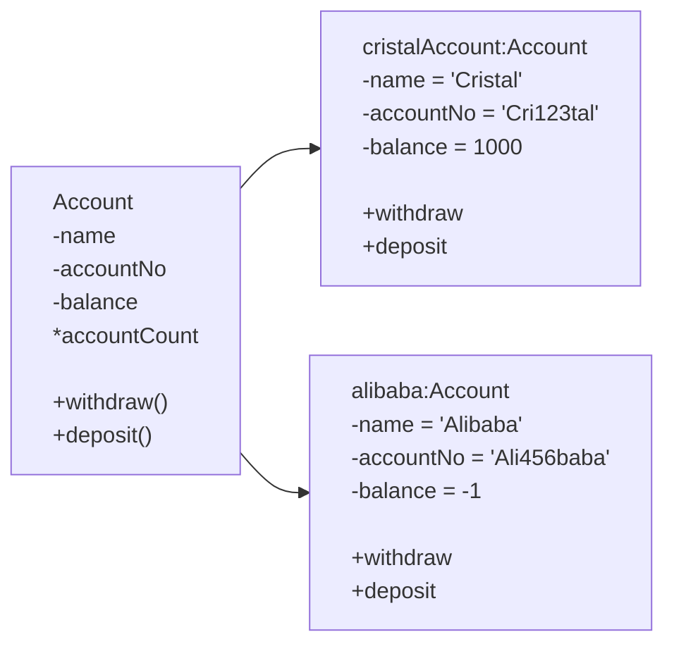

# Object-Oriented

- Data and operations (methods) are grouped together in a <u>class</u>

## Objects and Classes

- Classes reflect concepts
- Objects reflect instances that embody those concepts

### Classes

- A class captures the common attributes of the objects instantiated from it
- Characterises the common behaviour (methods) of all the objects that are its instances
- Example
    - attributes
        - name
        - accountNo
        - balance
    - behaviours/methods
        - withdraw()
        - deposit()

## Object vs Class



## Defining a class in Python

```python
class Account:
	#defined within a class but outside any of the class methods.
	accountCount = 0
	
	def __init__(self, name, accountNo):...
	
	def withdraw(self, amount):...
	
	def deposit(self, amount):...
```

### Class Variable

```python
def __init__(self, name, accountNo):
	self.name = name
	self.accountNo = accountNo
	self.balance = 0
	Account.accountcount += 1
	print(f"Account {self.accountNo} created")
	print(f"Account count = {Account.accountCount.__str__()}")
```

> [!note] ➡️
> what is the output of these statements?
> cristalAccount = Account(”Cristal”, “Cri123tal”)
> 
> alibabaAccount = Account(”Alibaba”, “Ali456baba”)
> 
> → Account Cri123tal created
> 
> → Account count = 1
> 
> → Account Ali456baba created
> 
> → Account count = 2

```python
class Account:
    """
    Docstring for Account class
    """
    #defined within a class but outside any of the class methods.
    account_count = 0
    def __init__(self, name: str, account_no: str) -> None:
        self.name = name
        self.account_no = account_no
        self.balance = 0
        Account.account_count += 1
        print(f"Account {self.account_no} created")
        print(f"Account count = {Account.account_count}")

    def withdraw(self, amount: float) -> None:
        """
        Docstring for withdraw
        
        :param self: Description
        :param amount: Description
        """
        if amount <= self.balance and amount >= 0:
            self.balance -= amount
            print(f"transaction successful! Balance = {self.balance}")
        else:
            print("Not enough balance")

    def deposit(self, amount: float) -> None:
        """
        Docstring for deposit

        :param self: Description
        :param amount: Description
        """
        if amount > 0:
            self.balance += amount
            print(f"transaction successful! Balance = {self.balance}")

def main():
    """
    Docstring for main
    """
    cristal_account = Account("Cristal", "Cri123tal")
    cristal_account.deposit(10000)
    cristal_account.withdraw(500)
    cristal_account.withdraw(10000)

if __name__ == "__main__":
    main()

```